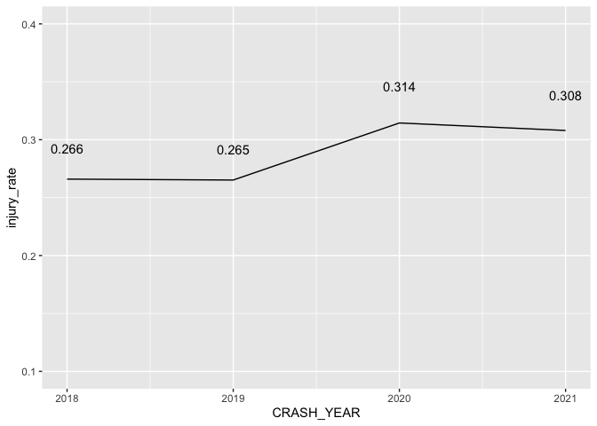
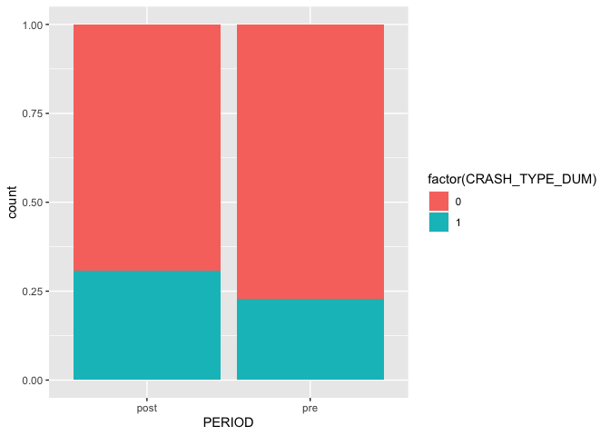
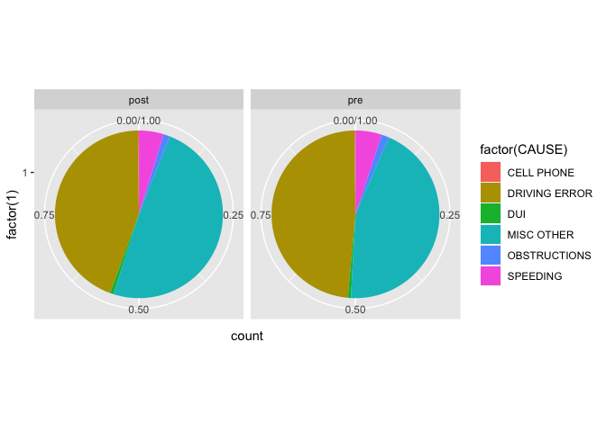

Analysis of Chicago traffic incident data
================

## Data

Data for this project was obtained from the Chicago Data Portal. It
contains 600k plus observations and has 49 features. (Making this 8gb
MacBook Air work)

``` r
library(tidyverse)
library(mice)
library(VIM)
library(lubridate)
library(gtsummary)
traffic <- read_csv("Traffic_Crashes_-_Crashes.csv")
```

## Data cleaning and manipulation

We chose to use the crash_type variable as the response which had Injury
or No injury categories. This was changed into a binary 0 if no, 1 if
yes. There is other similar creation of binary classifieres for a range
of variables as well as some date formatting.

``` r
traffic <- traffic %>%
  mutate(CRASH_YEAR = year(as.POSIXct(substr(traffic$CRASH_DATE, 1, 10), format = "%m/%d/%Y"))) %>% 
  mutate(CRASH_TYPE_DUM = ifelse(startsWith(traffic$CRASH_TYPE, "NO"), 0, 1)) %>% 
  mutate(PERIOD = ifelse(CRASH_YEAR < 2020, "pre", "post")) %>% 
  mutate(WEATHER_CLEAR = ifelse(str_detect(WEATHER_CONDITION, "CLEAR"), 1, 0)) %>% 
  mutate(LIGHTING_DARK = ifelse(str_detect(LIGHTING_CONDITION, "DARK"), 1, 0)) %>% 
  mutate(ROAD_WET = ifelse(str_detect(ROADWAY_SURFACE_COND, "DRY|UNKNOWN"), 0, 1)) %>% 
  mutate(INTERSECTION_RELATED_I = replace_na(INTERSECTION_RELATED_I, "N"))
```

## Exploratory data analysis

Getting a sense of the data. First looking at the injury rate over time.

``` r
traffic %>% 
  group_by(CRASH_YEAR) %>% 
  summarise(injuries_year = sum(CRASH_TYPE_DUM), total_crash = n()) %>% 
  mutate(injury_rate = injuries_year / total_crash) %>%
  filter(between(CRASH_YEAR, 2018, 2021)) %>% 
  ggplot(aes(CRASH_YEAR,injury_rate)) +
  geom_line() +
  geom_text(aes(label = round(injury_rate, 3)), position = position_stack(vjust = 1.1)) + 
  ylim(0.1, 0.4)
```

<!-- -->

There is definitely an increase in the injury rate in 2020 and it stays
elevated relative to the previous years.

``` r
traffic %>% 
  ggplot(aes(x = PERIOD, fill = factor(CRASH_TYPE_DUM))) +
  geom_bar(position = "fill")
```

<!-- -->

Looking at the rates in a new category - pre and post covid. Since the
change seemed to have occurred in 2020 we wanted to group the data into
these categories. The post covid proportion is clearly larger. We will
revisit this later and test whether these proportions are statistically
different.

``` r
traffic %>% 
  ggplot(aes(x=factor(1), stat = "bin", fill = factor(CAUSE))) +
  geom_bar(position = "fill") + 
  facet_grid(facets =. ~ PERIOD) +
  coord_polar(theta = "y")
```

<!-- -->

This is a breakdown of the accident causes. As you can see, a ton of
data is lableled “MISC Other”. Might have some opportunity to clean this
further in later analysis…

## Features we want to investigate

``` r
traffic2 <- traffic %>% 
  select(CRASH_TYPE_DUM, PERIOD, WEATHER_CLEAR, LIGHTING_DARK, ROAD_WET, INTERSECTION_RELATED_I,
         DAMAGE, STREET_DIRECTION, CAUSE, CRASH_YEAR, CRASH_MONTH, CRASH_DAY_OF_WEEK, CRASH_HOUR) %>% 
  mutate(across(CRASH_TYPE_DUM:CAUSE, factor))
```

## Individual Logistic Regressions

``` r
logistic_table <- traffic2 %>%
  select(CRASH_TYPE_DUM, PERIOD, WEATHER_CLEAR, LIGHTING_DARK, ROAD_WET, INTERSECTION_RELATED_I,
         DAMAGE, STREET_DIRECTION, CAUSE, CRASH_YEAR, CRASH_MONTH, CRASH_DAY_OF_WEEK,
         CRASH_HOUR) %>% 
  tbl_uvregression(
    method = glm,
    y = CRASH_TYPE_DUM,
    method.args = list(family = binomial),
    exponentiate = TRUE,
    pvalue_fun = ~style_pvalue(.x, digits = 3)
  )
logistic_table
```

<div id="ptucscuvzl" style="overflow-x:auto;overflow-y:auto;width:auto;height:auto;">
<style>html {
  font-family: -apple-system, BlinkMacSystemFont, 'Segoe UI', Roboto, Oxygen, Ubuntu, Cantarell, 'Helvetica Neue', 'Fira Sans', 'Droid Sans', Arial, sans-serif;
}

#ptucscuvzl .gt_table {
  display: table;
  border-collapse: collapse;
  margin-left: auto;
  margin-right: auto;
  color: #333333;
  font-size: 16px;
  font-weight: normal;
  font-style: normal;
  background-color: #FFFFFF;
  width: auto;
  border-top-style: solid;
  border-top-width: 2px;
  border-top-color: #A8A8A8;
  border-right-style: none;
  border-right-width: 2px;
  border-right-color: #D3D3D3;
  border-bottom-style: solid;
  border-bottom-width: 2px;
  border-bottom-color: #A8A8A8;
  border-left-style: none;
  border-left-width: 2px;
  border-left-color: #D3D3D3;
}

#ptucscuvzl .gt_heading {
  background-color: #FFFFFF;
  text-align: center;
  border-bottom-color: #FFFFFF;
  border-left-style: none;
  border-left-width: 1px;
  border-left-color: #D3D3D3;
  border-right-style: none;
  border-right-width: 1px;
  border-right-color: #D3D3D3;
}

#ptucscuvzl .gt_title {
  color: #333333;
  font-size: 125%;
  font-weight: initial;
  padding-top: 4px;
  padding-bottom: 4px;
  padding-left: 5px;
  padding-right: 5px;
  border-bottom-color: #FFFFFF;
  border-bottom-width: 0;
}

#ptucscuvzl .gt_subtitle {
  color: #333333;
  font-size: 85%;
  font-weight: initial;
  padding-top: 0;
  padding-bottom: 6px;
  padding-left: 5px;
  padding-right: 5px;
  border-top-color: #FFFFFF;
  border-top-width: 0;
}

#ptucscuvzl .gt_bottom_border {
  border-bottom-style: solid;
  border-bottom-width: 2px;
  border-bottom-color: #D3D3D3;
}

#ptucscuvzl .gt_col_headings {
  border-top-style: solid;
  border-top-width: 2px;
  border-top-color: #D3D3D3;
  border-bottom-style: solid;
  border-bottom-width: 2px;
  border-bottom-color: #D3D3D3;
  border-left-style: none;
  border-left-width: 1px;
  border-left-color: #D3D3D3;
  border-right-style: none;
  border-right-width: 1px;
  border-right-color: #D3D3D3;
}

#ptucscuvzl .gt_col_heading {
  color: #333333;
  background-color: #FFFFFF;
  font-size: 100%;
  font-weight: normal;
  text-transform: inherit;
  border-left-style: none;
  border-left-width: 1px;
  border-left-color: #D3D3D3;
  border-right-style: none;
  border-right-width: 1px;
  border-right-color: #D3D3D3;
  vertical-align: bottom;
  padding-top: 5px;
  padding-bottom: 6px;
  padding-left: 5px;
  padding-right: 5px;
  overflow-x: hidden;
}

#ptucscuvzl .gt_column_spanner_outer {
  color: #333333;
  background-color: #FFFFFF;
  font-size: 100%;
  font-weight: normal;
  text-transform: inherit;
  padding-top: 0;
  padding-bottom: 0;
  padding-left: 4px;
  padding-right: 4px;
}

#ptucscuvzl .gt_column_spanner_outer:first-child {
  padding-left: 0;
}

#ptucscuvzl .gt_column_spanner_outer:last-child {
  padding-right: 0;
}

#ptucscuvzl .gt_column_spanner {
  border-bottom-style: solid;
  border-bottom-width: 2px;
  border-bottom-color: #D3D3D3;
  vertical-align: bottom;
  padding-top: 5px;
  padding-bottom: 5px;
  overflow-x: hidden;
  display: inline-block;
  width: 100%;
}

#ptucscuvzl .gt_group_heading {
  padding-top: 8px;
  padding-bottom: 8px;
  padding-left: 5px;
  padding-right: 5px;
  color: #333333;
  background-color: #FFFFFF;
  font-size: 100%;
  font-weight: initial;
  text-transform: inherit;
  border-top-style: solid;
  border-top-width: 2px;
  border-top-color: #D3D3D3;
  border-bottom-style: solid;
  border-bottom-width: 2px;
  border-bottom-color: #D3D3D3;
  border-left-style: none;
  border-left-width: 1px;
  border-left-color: #D3D3D3;
  border-right-style: none;
  border-right-width: 1px;
  border-right-color: #D3D3D3;
  vertical-align: middle;
}

#ptucscuvzl .gt_empty_group_heading {
  padding: 0.5px;
  color: #333333;
  background-color: #FFFFFF;
  font-size: 100%;
  font-weight: initial;
  border-top-style: solid;
  border-top-width: 2px;
  border-top-color: #D3D3D3;
  border-bottom-style: solid;
  border-bottom-width: 2px;
  border-bottom-color: #D3D3D3;
  vertical-align: middle;
}

#ptucscuvzl .gt_from_md > :first-child {
  margin-top: 0;
}

#ptucscuvzl .gt_from_md > :last-child {
  margin-bottom: 0;
}

#ptucscuvzl .gt_row {
  padding-top: 8px;
  padding-bottom: 8px;
  padding-left: 5px;
  padding-right: 5px;
  margin: 10px;
  border-top-style: solid;
  border-top-width: 1px;
  border-top-color: #D3D3D3;
  border-left-style: none;
  border-left-width: 1px;
  border-left-color: #D3D3D3;
  border-right-style: none;
  border-right-width: 1px;
  border-right-color: #D3D3D3;
  vertical-align: middle;
  overflow-x: hidden;
}

#ptucscuvzl .gt_stub {
  color: #333333;
  background-color: #FFFFFF;
  font-size: 100%;
  font-weight: initial;
  text-transform: inherit;
  border-right-style: solid;
  border-right-width: 2px;
  border-right-color: #D3D3D3;
  padding-left: 5px;
  padding-right: 5px;
}

#ptucscuvzl .gt_stub_row_group {
  color: #333333;
  background-color: #FFFFFF;
  font-size: 100%;
  font-weight: initial;
  text-transform: inherit;
  border-right-style: solid;
  border-right-width: 2px;
  border-right-color: #D3D3D3;
  padding-left: 5px;
  padding-right: 5px;
  vertical-align: top;
}

#ptucscuvzl .gt_row_group_first td {
  border-top-width: 2px;
}

#ptucscuvzl .gt_summary_row {
  color: #333333;
  background-color: #FFFFFF;
  text-transform: inherit;
  padding-top: 8px;
  padding-bottom: 8px;
  padding-left: 5px;
  padding-right: 5px;
}

#ptucscuvzl .gt_first_summary_row {
  border-top-style: solid;
  border-top-color: #D3D3D3;
}

#ptucscuvzl .gt_first_summary_row.thick {
  border-top-width: 2px;
}

#ptucscuvzl .gt_last_summary_row {
  padding-top: 8px;
  padding-bottom: 8px;
  padding-left: 5px;
  padding-right: 5px;
  border-bottom-style: solid;
  border-bottom-width: 2px;
  border-bottom-color: #D3D3D3;
}

#ptucscuvzl .gt_grand_summary_row {
  color: #333333;
  background-color: #FFFFFF;
  text-transform: inherit;
  padding-top: 8px;
  padding-bottom: 8px;
  padding-left: 5px;
  padding-right: 5px;
}

#ptucscuvzl .gt_first_grand_summary_row {
  padding-top: 8px;
  padding-bottom: 8px;
  padding-left: 5px;
  padding-right: 5px;
  border-top-style: double;
  border-top-width: 6px;
  border-top-color: #D3D3D3;
}

#ptucscuvzl .gt_striped {
  background-color: rgba(128, 128, 128, 0.05);
}

#ptucscuvzl .gt_table_body {
  border-top-style: solid;
  border-top-width: 2px;
  border-top-color: #D3D3D3;
  border-bottom-style: solid;
  border-bottom-width: 2px;
  border-bottom-color: #D3D3D3;
}

#ptucscuvzl .gt_footnotes {
  color: #333333;
  background-color: #FFFFFF;
  border-bottom-style: none;
  border-bottom-width: 2px;
  border-bottom-color: #D3D3D3;
  border-left-style: none;
  border-left-width: 2px;
  border-left-color: #D3D3D3;
  border-right-style: none;
  border-right-width: 2px;
  border-right-color: #D3D3D3;
}

#ptucscuvzl .gt_footnote {
  margin: 0px;
  font-size: 90%;
  padding-left: 4px;
  padding-right: 4px;
  padding-left: 5px;
  padding-right: 5px;
}

#ptucscuvzl .gt_sourcenotes {
  color: #333333;
  background-color: #FFFFFF;
  border-bottom-style: none;
  border-bottom-width: 2px;
  border-bottom-color: #D3D3D3;
  border-left-style: none;
  border-left-width: 2px;
  border-left-color: #D3D3D3;
  border-right-style: none;
  border-right-width: 2px;
  border-right-color: #D3D3D3;
}

#ptucscuvzl .gt_sourcenote {
  font-size: 90%;
  padding-top: 4px;
  padding-bottom: 4px;
  padding-left: 5px;
  padding-right: 5px;
}

#ptucscuvzl .gt_left {
  text-align: left;
}

#ptucscuvzl .gt_center {
  text-align: center;
}

#ptucscuvzl .gt_right {
  text-align: right;
  font-variant-numeric: tabular-nums;
}

#ptucscuvzl .gt_font_normal {
  font-weight: normal;
}

#ptucscuvzl .gt_font_bold {
  font-weight: bold;
}

#ptucscuvzl .gt_font_italic {
  font-style: italic;
}

#ptucscuvzl .gt_super {
  font-size: 65%;
}

#ptucscuvzl .gt_footnote_marks {
  font-style: italic;
  font-weight: normal;
  font-size: 75%;
  vertical-align: 0.4em;
}

#ptucscuvzl .gt_asterisk {
  font-size: 100%;
  vertical-align: 0;
}

#ptucscuvzl .gt_slash_mark {
  font-size: 0.7em;
  line-height: 0.7em;
  vertical-align: 0.15em;
}

#ptucscuvzl .gt_fraction_numerator {
  font-size: 0.6em;
  line-height: 0.6em;
  vertical-align: 0.45em;
}

#ptucscuvzl .gt_fraction_denominator {
  font-size: 0.6em;
  line-height: 0.6em;
  vertical-align: -0.05em;
}
</style>
<table class="gt_table">
  
  <thead class="gt_col_headings">
    <tr>
      <th class="gt_col_heading gt_columns_bottom_border gt_left" rowspan="1" colspan="1"><strong>Characteristic</strong></th>
      <th class="gt_col_heading gt_columns_bottom_border gt_center" rowspan="1" colspan="1"><strong>N</strong></th>
      <th class="gt_col_heading gt_columns_bottom_border gt_center" rowspan="1" colspan="1"><strong>OR</strong><sup class="gt_footnote_marks">1</sup></th>
      <th class="gt_col_heading gt_columns_bottom_border gt_center" rowspan="1" colspan="1"><strong>95% CI</strong><sup class="gt_footnote_marks">1</sup></th>
      <th class="gt_col_heading gt_columns_bottom_border gt_center" rowspan="1" colspan="1"><strong>p-value</strong></th>
    </tr>
  </thead>
  <tbody class="gt_table_body">
    <tr><td class="gt_row gt_left">PERIOD</td>
<td class="gt_row gt_center">603,121</td>
<td class="gt_row gt_center"></td>
<td class="gt_row gt_center"></td>
<td class="gt_row gt_center"></td></tr>
    <tr><td class="gt_row gt_left" style="text-align: left; text-indent: 10px;">post</td>
<td class="gt_row gt_center"></td>
<td class="gt_row gt_center">—</td>
<td class="gt_row gt_center">—</td>
<td class="gt_row gt_center"></td></tr>
    <tr><td class="gt_row gt_left" style="text-align: left; text-indent: 10px;">pre</td>
<td class="gt_row gt_center"></td>
<td class="gt_row gt_center">0.66</td>
<td class="gt_row gt_center">0.66, 0.67</td>
<td class="gt_row gt_center"><0.001</td></tr>
    <tr><td class="gt_row gt_left">WEATHER_CLEAR</td>
<td class="gt_row gt_center">603,121</td>
<td class="gt_row gt_center"></td>
<td class="gt_row gt_center"></td>
<td class="gt_row gt_center"></td></tr>
    <tr><td class="gt_row gt_left" style="text-align: left; text-indent: 10px;">0</td>
<td class="gt_row gt_center"></td>
<td class="gt_row gt_center">—</td>
<td class="gt_row gt_center">—</td>
<td class="gt_row gt_center"></td></tr>
    <tr><td class="gt_row gt_left" style="text-align: left; text-indent: 10px;">1</td>
<td class="gt_row gt_center"></td>
<td class="gt_row gt_center">0.95</td>
<td class="gt_row gt_center">0.94, 0.96</td>
<td class="gt_row gt_center"><0.001</td></tr>
    <tr><td class="gt_row gt_left">LIGHTING_DARK</td>
<td class="gt_row gt_center">603,121</td>
<td class="gt_row gt_center"></td>
<td class="gt_row gt_center"></td>
<td class="gt_row gt_center"></td></tr>
    <tr><td class="gt_row gt_left" style="text-align: left; text-indent: 10px;">0</td>
<td class="gt_row gt_center"></td>
<td class="gt_row gt_center">—</td>
<td class="gt_row gt_center">—</td>
<td class="gt_row gt_center"></td></tr>
    <tr><td class="gt_row gt_left" style="text-align: left; text-indent: 10px;">1</td>
<td class="gt_row gt_center"></td>
<td class="gt_row gt_center">1.89</td>
<td class="gt_row gt_center">1.87, 1.92</td>
<td class="gt_row gt_center"><0.001</td></tr>
    <tr><td class="gt_row gt_left">ROAD_WET</td>
<td class="gt_row gt_center">603,121</td>
<td class="gt_row gt_center"></td>
<td class="gt_row gt_center"></td>
<td class="gt_row gt_center"></td></tr>
    <tr><td class="gt_row gt_left" style="text-align: left; text-indent: 10px;">0</td>
<td class="gt_row gt_center"></td>
<td class="gt_row gt_center">—</td>
<td class="gt_row gt_center">—</td>
<td class="gt_row gt_center"></td></tr>
    <tr><td class="gt_row gt_left" style="text-align: left; text-indent: 10px;">1</td>
<td class="gt_row gt_center"></td>
<td class="gt_row gt_center">1.39</td>
<td class="gt_row gt_center">1.37, 1.41</td>
<td class="gt_row gt_center"><0.001</td></tr>
    <tr><td class="gt_row gt_left">INTERSECTION_RELATED_I</td>
<td class="gt_row gt_center">603,121</td>
<td class="gt_row gt_center"></td>
<td class="gt_row gt_center"></td>
<td class="gt_row gt_center"></td></tr>
    <tr><td class="gt_row gt_left" style="text-align: left; text-indent: 10px;">N</td>
<td class="gt_row gt_center"></td>
<td class="gt_row gt_center">—</td>
<td class="gt_row gt_center">—</td>
<td class="gt_row gt_center"></td></tr>
    <tr><td class="gt_row gt_left" style="text-align: left; text-indent: 10px;">Y</td>
<td class="gt_row gt_center"></td>
<td class="gt_row gt_center">2.83</td>
<td class="gt_row gt_center">2.79, 2.86</td>
<td class="gt_row gt_center"><0.001</td></tr>
    <tr><td class="gt_row gt_left">DAMAGE</td>
<td class="gt_row gt_center">603,121</td>
<td class="gt_row gt_center"></td>
<td class="gt_row gt_center"></td>
<td class="gt_row gt_center"></td></tr>
    <tr><td class="gt_row gt_left" style="text-align: left; text-indent: 10px;">$500 OR LESS</td>
<td class="gt_row gt_center"></td>
<td class="gt_row gt_center">—</td>
<td class="gt_row gt_center">—</td>
<td class="gt_row gt_center"></td></tr>
    <tr><td class="gt_row gt_left" style="text-align: left; text-indent: 10px;">$501 - $1,500</td>
<td class="gt_row gt_center"></td>
<td class="gt_row gt_center">0.48</td>
<td class="gt_row gt_center">0.47, 0.49</td>
<td class="gt_row gt_center"><0.001</td></tr>
    <tr><td class="gt_row gt_left" style="text-align: left; text-indent: 10px;">OVER $1,500</td>
<td class="gt_row gt_center"></td>
<td class="gt_row gt_center">2.34</td>
<td class="gt_row gt_center">2.29, 2.38</td>
<td class="gt_row gt_center"><0.001</td></tr>
    <tr><td class="gt_row gt_left">STREET_DIRECTION</td>
<td class="gt_row gt_center">603,117</td>
<td class="gt_row gt_center"></td>
<td class="gt_row gt_center"></td>
<td class="gt_row gt_center"></td></tr>
    <tr><td class="gt_row gt_left" style="text-align: left; text-indent: 10px;">E</td>
<td class="gt_row gt_center"></td>
<td class="gt_row gt_center">—</td>
<td class="gt_row gt_center">—</td>
<td class="gt_row gt_center"></td></tr>
    <tr><td class="gt_row gt_left" style="text-align: left; text-indent: 10px;">N</td>
<td class="gt_row gt_center"></td>
<td class="gt_row gt_center">0.85</td>
<td class="gt_row gt_center">0.83, 0.88</td>
<td class="gt_row gt_center"><0.001</td></tr>
    <tr><td class="gt_row gt_left" style="text-align: left; text-indent: 10px;">S</td>
<td class="gt_row gt_center"></td>
<td class="gt_row gt_center">0.98</td>
<td class="gt_row gt_center">0.96, 1.01</td>
<td class="gt_row gt_center">0.131</td></tr>
    <tr><td class="gt_row gt_left" style="text-align: left; text-indent: 10px;">W</td>
<td class="gt_row gt_center"></td>
<td class="gt_row gt_center">0.94</td>
<td class="gt_row gt_center">0.92, 0.96</td>
<td class="gt_row gt_center"><0.001</td></tr>
    <tr><td class="gt_row gt_left">CAUSE</td>
<td class="gt_row gt_center">603,121</td>
<td class="gt_row gt_center"></td>
<td class="gt_row gt_center"></td>
<td class="gt_row gt_center"></td></tr>
    <tr><td class="gt_row gt_left" style="text-align: left; text-indent: 10px;">CELL PHONE</td>
<td class="gt_row gt_center"></td>
<td class="gt_row gt_center">—</td>
<td class="gt_row gt_center">—</td>
<td class="gt_row gt_center"></td></tr>
    <tr><td class="gt_row gt_left" style="text-align: left; text-indent: 10px;">DRIVING ERROR</td>
<td class="gt_row gt_center"></td>
<td class="gt_row gt_center">0.50</td>
<td class="gt_row gt_center">0.45, 0.57</td>
<td class="gt_row gt_center"><0.001</td></tr>
    <tr><td class="gt_row gt_left" style="text-align: left; text-indent: 10px;">DUI</td>
<td class="gt_row gt_center"></td>
<td class="gt_row gt_center">3.73</td>
<td class="gt_row gt_center">3.25, 4.29</td>
<td class="gt_row gt_center"><0.001</td></tr>
    <tr><td class="gt_row gt_left" style="text-align: left; text-indent: 10px;">MISC OTHER</td>
<td class="gt_row gt_center"></td>
<td class="gt_row gt_center">0.37</td>
<td class="gt_row gt_center">0.33, 0.42</td>
<td class="gt_row gt_center"><0.001</td></tr>
    <tr><td class="gt_row gt_left" style="text-align: left; text-indent: 10px;">OBSTRUCTIONS</td>
<td class="gt_row gt_center"></td>
<td class="gt_row gt_center">0.77</td>
<td class="gt_row gt_center">0.68, 0.88</td>
<td class="gt_row gt_center"><0.001</td></tr>
    <tr><td class="gt_row gt_left" style="text-align: left; text-indent: 10px;">SPEEDING</td>
<td class="gt_row gt_center"></td>
<td class="gt_row gt_center">1.07</td>
<td class="gt_row gt_center">0.95, 1.21</td>
<td class="gt_row gt_center">0.281</td></tr>
    <tr><td class="gt_row gt_left">CRASH_YEAR</td>
<td class="gt_row gt_center">603,121</td>
<td class="gt_row gt_center">1.18</td>
<td class="gt_row gt_center">1.17, 1.18</td>
<td class="gt_row gt_center"><0.001</td></tr>
    <tr><td class="gt_row gt_left">CRASH_MONTH</td>
<td class="gt_row gt_center">603,121</td>
<td class="gt_row gt_center">1.01</td>
<td class="gt_row gt_center">1.01, 1.01</td>
<td class="gt_row gt_center"><0.001</td></tr>
    <tr><td class="gt_row gt_left">CRASH_DAY_OF_WEEK</td>
<td class="gt_row gt_center">603,121</td>
<td class="gt_row gt_center">0.99</td>
<td class="gt_row gt_center">0.99, 0.99</td>
<td class="gt_row gt_center"><0.001</td></tr>
    <tr><td class="gt_row gt_left">CRASH_HOUR</td>
<td class="gt_row gt_center">603,121</td>
<td class="gt_row gt_center">0.98</td>
<td class="gt_row gt_center">0.98, 0.98</td>
<td class="gt_row gt_center"><0.001</td></tr>
  </tbody>
  
  <tfoot class="gt_footnotes">
    <tr>
      <td class="gt_footnote" colspan="5"><sup class="gt_footnote_marks">1</sup> OR = Odds Ratio, CI = Confidence Interval</td>
    </tr>
  </tfoot>
</table>
</div>

The odds ratio for Lighting conditions, Intersection related, damage
over 1500, and DUI are especially high relative to other features.

## 2x2 table for pre and post covid injury rates

Back to test if these are statistically different

``` r
dattable <- traffic %>% 
  group_by(PERIOD) %>% 
  summarise(injuries_period = sum(CRASH_TYPE_DUM), total_crash = n())

table2_2 <- tibble(Group = c("Pre-pandemic", "Pre-pandemic","Post-pandemic", "Post-pandemic"),
                   Injury = c("Yes", "No", "Yes", "No"),
                   Count = c(85524, 374627 - 85524, 70435, 228494 - 70435))

addmargins(xtabs(Count ~ Group + Injury, table2_2))
```

    ##                Injury
    ## Group               No    Yes    Sum
    ##   Post-pandemic 158059  70435 228494
    ##   Pre-pandemic  289103  85524 374627
    ##   Sum           447162 155959 603121

``` r
prop.test(c(70435, 85524), c(228494, 374627), correct = FALSE)
```

    ## 
    ##  2-sample test for equality of proportions without continuity
    ##  correction
    ## 
    ## data:  c(70435, 85524) out of c(228494, 374627)
    ## X-squared = 4733.9, df = 1, p-value < 2.2e-16
    ## alternative hypothesis: two.sided
    ## 95 percent confidence interval:
    ##  0.07764453 0.08228842
    ## sample estimates:
    ##    prop 1    prop 2 
    ## 0.3082575 0.2282911

``` r
oddspost <- (70435/228494) / (1 - (70435/228494))
oddspre <- (85524/374627) / (1- (85524/374627))
odds_rat <- oddspost/oddspre
RRpan <- (70435/228494) / (85524/374627)
odds_rat
```

    ## [1] 1.506378

Interesting, the proportion test indicates that these are in fact
different rates. Additionally, The odds of of injury post covid are 1.51
times higher than having an injury pre covid. This should definitely be
investigated further.

## Logistic model

Settled on this slightly reduced model for the sake of interpretation.

``` r
log_mod <- glm(CRASH_TYPE_DUM ~ PERIOD + WEATHER_CLEAR + LIGHTING_DARK +
                 ROAD_WET + INTERSECTION_RELATED_I + DAMAGE + CAUSE,
               family = binomial,
               data = traffic2)
summary(log_mod)
```

    ## 
    ## Call:
    ## glm(formula = CRASH_TYPE_DUM ~ PERIOD + WEATHER_CLEAR + LIGHTING_DARK + 
    ##     ROAD_WET + INTERSECTION_RELATED_I + DAMAGE + CAUSE, family = binomial, 
    ##     data = traffic2)
    ## 
    ## Deviance Residuals: 
    ##     Min       1Q   Median       3Q      Max  
    ## -2.3320  -0.7803  -0.5114   0.8723   2.4986  
    ## 
    ## Coefficients:
    ##                          Estimate Std. Error z value Pr(>|z|)    
    ## (Intercept)             -1.114953   0.066828 -16.684   <2e-16 ***
    ## PERIODpre               -0.344218   0.006430 -53.530   <2e-16 ***
    ## WEATHER_CLEAR1           0.218432   0.010287  21.234   <2e-16 ***
    ## LIGHTING_DARK1           0.522565   0.006834  76.465   <2e-16 ***
    ## ROAD_WET1                0.367368   0.010425  35.241   <2e-16 ***
    ## INTERSECTION_RELATED_IY  0.962567   0.007101 135.555   <2e-16 ***
    ## DAMAGE$501 - $1,500     -0.722402   0.012807 -56.406   <2e-16 ***
    ## DAMAGEOVER $1,500        0.758053   0.010465  72.435   <2e-16 ***
    ## CAUSEDRIVING ERROR      -0.737745   0.065436 -11.274   <2e-16 ***
    ## CAUSEDUI                 1.155258   0.076066  15.188   <2e-16 ***
    ## CAUSEMISC OTHER         -0.894846   0.065454 -13.671   <2e-16 ***
    ## CAUSEOBSTRUCTIONS       -0.155920   0.069682  -2.238   0.0252 *  
    ## CAUSESPEEDING           -0.053951   0.066452  -0.812   0.4169    
    ## ---
    ## Signif. codes:  0 '***' 0.001 '**' 0.01 '*' 0.05 '.' 0.1 ' ' 1
    ## 
    ## (Dispersion parameter for binomial family taken to be 1)
    ## 
    ##     Null deviance: 689456  on 603120  degrees of freedom
    ## Residual deviance: 606639  on 603108  degrees of freedom
    ## AIC: 606665
    ## 
    ## Number of Fisher Scoring iterations: 5

Getting some probabilities

``` r
logmodcoef <- coef(log_mod)
pi1 <- exp(logmodcoef[1] + logmodcoef[4] +logmodcoef[5] +
             logmodcoef[6] + logmodcoef[8] + logmodcoef[10]) / 
  (1 + exp(logmodcoef[1] + logmodcoef[4] +logmodcoef[5] +
             logmodcoef[6] + logmodcoef[8] + logmodcoef[10]))
pi2 <- exp(logmodcoef[1] + logmodcoef[2] + logmodcoef[3]) / 
  (1 + exp(logmodcoef[1] + logmodcoef[2] + logmodcoef[3]))
pi1
```

    ## (Intercept) 
    ##   0.9340639

``` r
pi2
```

    ## (Intercept) 
    ##   0.2243074

You can see how all the different factors increase the overall
probability of being injured.

For instance, if you are driving post covid at night in the rain, and in
and intersection (among other things) your probability of being injured
is very high - around 0.93

While if you are not in those situations the probability is much lower -
around 0.22

Although this seems pretty intuitive, it is still interesting to see how
much all these factors together increase the probability of injury in
the data.

## Exploring multi category logit models

Changing the response variable to Damage which has 3 levels (\<500,
501-1500, \>1500)

Here is the model for incidents in an intersection. Our reference
category was \>1500.

``` r
library(VGAM)
mult_mod2 <- vglm(DAMAGE ~ INTERSECTION_RELATED_I,
                 family = multinomial,
                 data = traffic2)
summary(mult_mod2)
```

    ## 
    ## Call:
    ## vglm(formula = DAMAGE ~ INTERSECTION_RELATED_I, family = multinomial, 
    ##     data = traffic2)
    ## 
    ## Coefficients: 
    ##                            Estimate Std. Error z value Pr(>|z|)    
    ## (Intercept):1             -1.521535   0.004537 -335.37   <2e-16 ***
    ## (Intercept):2             -0.649603   0.003279 -198.10   <2e-16 ***
    ## INTERSECTION_RELATED_IY:1 -0.315210   0.010141  -31.08   <2e-16 ***
    ## INTERSECTION_RELATED_IY:2 -0.474253   0.007539  -62.90   <2e-16 ***
    ## ---
    ## Signif. codes:  0 '***' 0.001 '**' 0.01 '*' 0.05 '.' 0.1 ' ' 1
    ## 
    ## Names of linear predictors: log(mu[,1]/mu[,3]), log(mu[,2]/mu[,3])
    ## 
    ## Residual deviance: 1107182 on 1206238 degrees of freedom
    ## 
    ## Log-likelihood: -553590.8 on 1206238 degrees of freedom
    ## 
    ## Number of Fisher scoring iterations: 5 
    ## 
    ## No Hauck-Donner effect found in any of the estimates
    ## 
    ## 
    ## Reference group is level  3  of the response

Now the explenations for these are slighlty tricky, but essentially the
estimated odds of having damage of \<500 relative to damage of \>1500 is
exp(-.31521) = 0.7296

This implies that having an incident in an intersection is conducive to
increased Damage dollars.

## Future work

The logistic model does highlight important features that increase odds
which seem to match our intuitive thinking about driving. However, there
is an interesting time component to this data that should be
investigated further using a time series, etc.
